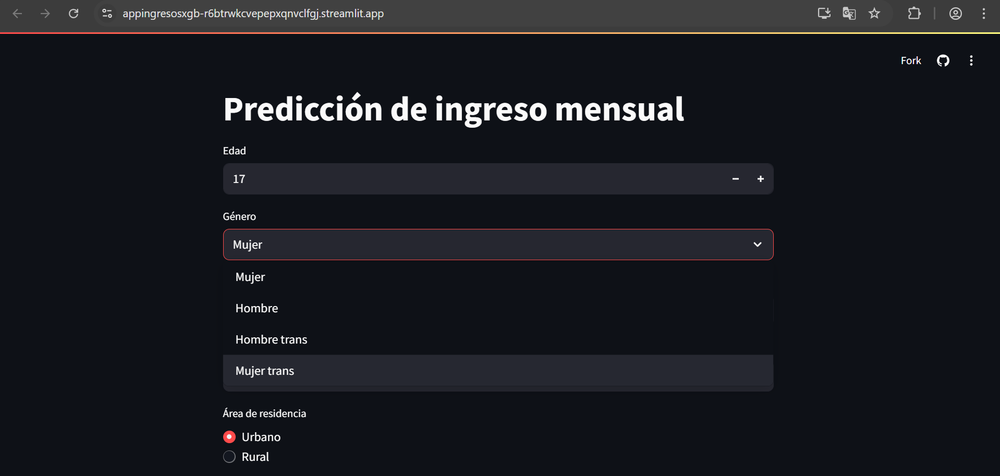

La aplicación desarrollada consiste en un formulario interactivo que permite al usuario ingresar diversas características sociodemográficas, educativas y laborales, con el fin de estimar el ingreso mensual de una persona en Colombia. Esta herramienta utiliza como base el modelo final seleccionado (XGBoost Tuned) y ha sido desplegada mediante la plataforma Streamlit, lo que facilita su acceso y uso desde cualquier navegador web.

**Puede accederse a la aplicación a través del siguiente enlace:**

[https://appingresosxgb-r6btrwkcvepepxqnvclfgj.streamlit.app/](https://appingresosxgb-r6btrwkcvepepxqnvclfgj.streamlit.app/)

Para utilizarla, solo es necesario ingresar al enlace mencionado. El formulario incluye preguntas con opciones predeterminadas y otras donde se requiere la introducción de valores numéricos, como la edad o las horas semanales dedicadas a ciertas actividades. De forma predeterminada, los campos están completados con las características del personaje del caso “Una historia de vida”: una joven indígena de 17 años que vive en la región Caribe, lo que permite ilustrar un ejemplo concreto desde el primer acceso a la herramienta.

Al final de la app, hay una sección sobre más acerca de la aplicación y los créditos correspondientes, en la que aparece la siguiente información:

**Sobre esta aplicación**
**Autores:** Juan David Cetina Gómez, Mariana Salas Gutiérrez, Katherin Juliana Moreno Carvajal

**Descripción:** Esta aplicación predice el ingreso mensual basado en datos socioeconómicos usando un modelo XGBoost entrenado con la encuesta GEIH Colombia.

**Limitaciones del modelo:** Esta predicción se basa en patrones históricos y no garantiza exactitud en casos individuales. El modelo puede presentar sesgos inherentes a los datos de entrenamiento.

© 2025 Todos los derechos reservados.
